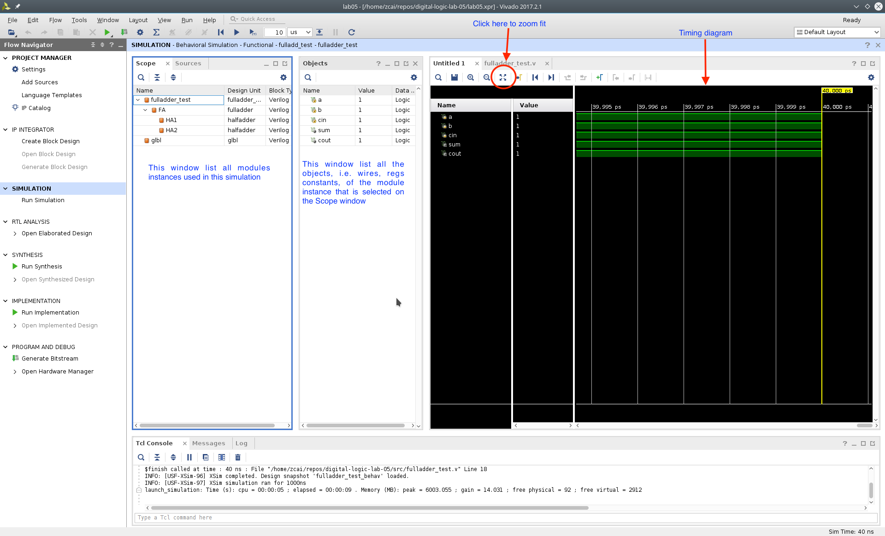
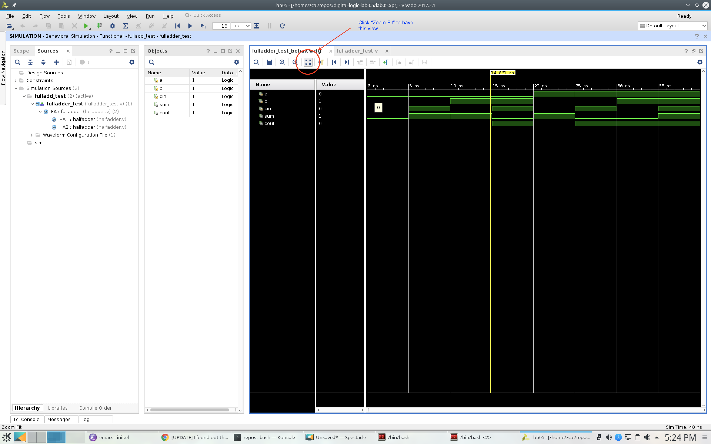

# Digital Logic Lab 05 - Verilog Intro

## References:
- [FPGA Prototyping By Verilog Examples: Xilinx Spartan-3 Version](https://www.amazon.com/FPGA-Prototyping-Verilog-Examples-Spartan-3/dp/0470185325/)
- [Quick Reference Guide](http://sutherland-hdl.com/pdfs/verilog_2001_ref_guide.pdf)

## Verilog

- It is a **H**ardware **D**escription **L**anguage. A specification language, not a programming language.
- It is used for
  - Behavior modeling
  - Gate level modeling
  - Transistor level modeling
  - Simulation

| Processor | Year | Transistor count|
| --------- |:----:| ----------------:|
| Intel 8085 | 1976 | 6,500 |
| Intel 8086 | 1978 | 29,000 |
| Quad-core + GPU GT2 Core i7 Skylake K | 2015 | 1,750,000,000
| NVIDIA GV100 Volta | 2017 | 21,100,000,000 |

<!-- ### [Reserved Keywords](http://sutherland-hdl.com/pdfs/verilog_2001_ref_guide.pdf#page=7) -->
<!-- ### [Concurrency](http://sutherland-hdl.com/pdfs/verilog_2001_ref_guide.pdf#page=8) -->
- [Basic Syntax](http://sutherland-hdl.com/pdfs/verilog_2001_ref_guide.pdf#page=8)
- [Data Type Declarations](http://sutherland-hdl.com/pdfs/verilog_2001_ref_guide.pdf#page=15)
  - **wire**
    - Interconnecting wire, connect output to input
    - Its value is driven by whatever the output it is connected to.
    - Can be either input or output type.
  - **reg**
    - A variable whose behavior need to be defined. **NOTE: It's not a register**
    - Driver / behavior is defined in ```always``` or ```initial``` block.
    - Could be used as output type.
    - Should not be used as input type.
  - Logic Values

	 | Logic Values | Description | Simulation Color |
	 |:------------:|:----------- |:---------------- |
	 | 0 | zero, low, or false | Green |
	 | 1 | one, high, or true | Green |
	 | **z** or **Z** | high impedence (tri-stated or floating) | Blue |
	 | **x** or **X** | unknown or uninitialized or don't-care | Red |

- [Module Definition](http://sutherland-hdl.com/pdfs/verilog_2001_ref_guide.pdf#page=12)

  Example:
  - Behavior modeling:
  ``` verilog
  module halfadder (input a, b,
                    output s, c);

     assign s = a ^ b;
     assign c = a & b;

  endmodule // halfadder
  ```

  - Gate level modeling:
  ``` verilog
  module halfadder (input a, b,
                    output s, c);

     xor(s, a, b);
     and(c, a, b);

  endmodule // halfadder
  ```

  - By default, if you just specify input or output, the signal is assumed to be wire.
  - **Any undeclared signal** is assumed to be 1 bit wire.

- [Module Instances](http://sutherland-hdl.com/pdfs/verilog_2001_ref_guide.pdf#page=21)
  Example:
  ```verilog
  module fulladder (input a, b, cin,
                    output sum, cout);

     wire                  s1, c1, c2;

     halfadder HA1(.a(a), .b(b), .s(s1), .c(c1));
     halfadder HA2(.a(s1), .b(cin), .s(sum), .c(c2));

     assign cout = c1 | c2;
     // and(cout, c1, c2);

  endmodule // fulladder
  ```
  - **Must** use dot syntax to instantiate a module

- [Primitive Instances](http://sutherland-hdl.com/pdfs/verilog_2001_ref_guide.pdf#page=23)
  - Primitive instances do not use dot syntax

- [Procedural Blocks](http://sutherland-hdl.com/pdfs/verilog_2001_ref_guide.pdf#page=25)
  - ```initial```
    - Mostly used in simulation (or initializing registers, depending on compiler support)
    - Could have multiple ```initial``` block
  - ```always```
    - It is used for defining behaviors of **reg** type

<!-- - [Common System Tasks and Functions](http://sutherland-hdl.com/pdfs/verilog_2001_ref_guide.pdf#page=42) -->
- [Generate Block](http://sutherland-hdl.com/pdfs/verilog_2001_ref_guide.pdf#page=25)

## Vivado

### [Download](https://www.xilinx.com/support/download.html)

### Installation
  - Make sure you select the WebPACK edition (first option). It's free, no license required, and has all the features we need.
  - After installed vivado, [install board files](https://reference.digilentinc.com/reference/software/vivado/board-files)

### Creating Project
**Note*: the following screenshots are captured with Vivado 2017.2.1, layout might be a bit different but you should be able find all the buttons in 2014 version.

1. Clone this assignment repo to your local machine, make sure you know the path
2. Create project
3. Choose your project path and project name **DO NOT** create project subdirectory.


### Simulation

Click on run simulation, and here is the default layout:



Click on "zoom fit" to have the best view of your timing diagram



