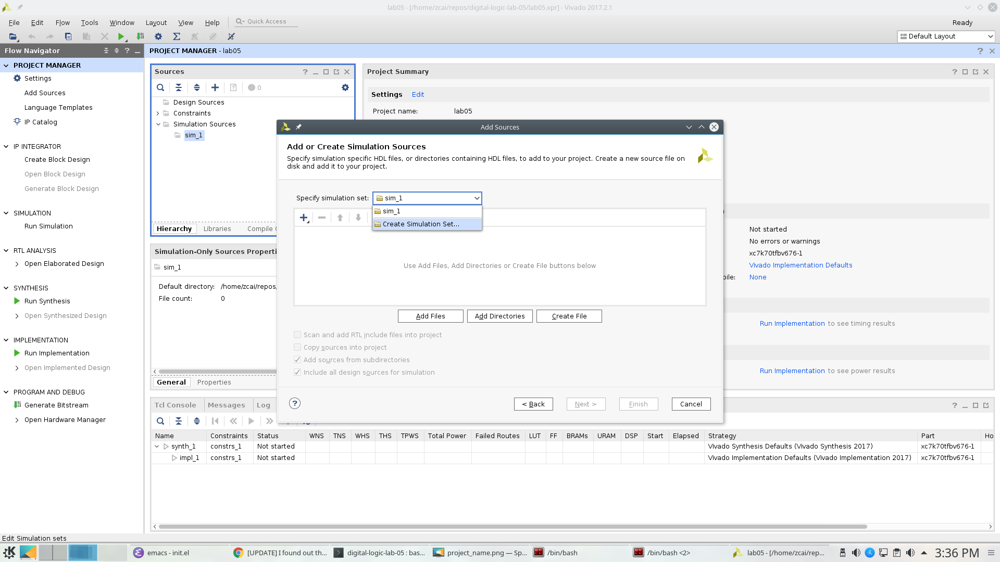
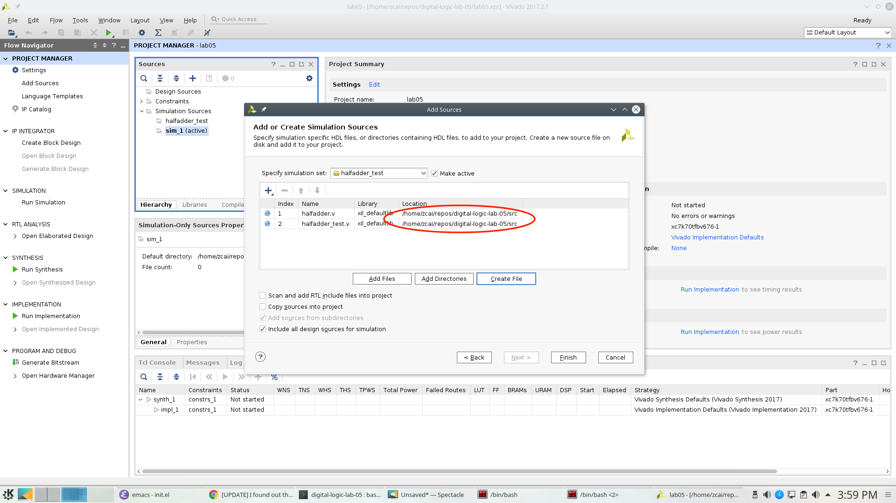

- [Digital Logic Lab 05 - Verilog Intro](#digital-logic-lab-05---verilog-intro)
  - [References:](#references)
  - [[Transistor Count of CPUs](https://en.wikipedia.org/wiki/Transistor_count)](#transistor-count-of-cpus)
  - [Commonly used HDL (Hardware Description Languages)](#commonly-used-hdl-hardware-description-languages)
  - [Verilog Usage](#verilog)
- [Verilog Intro](#orga560c24)
  - [Basic Building Block &#x2013; modules](#org088c1aa)
  - [Procedural Blocks](#org9d0d2a9)
    - [Types](#orgc6ee982)
  - [Variable types:](#org89fd6ab)
    - [wire](#orgea8c782)
    - [reg](#org7df7305)
  - [[Data Type Declarations](http://sutherland-hdl.com/pdfs/verilog_2001_ref_guide.pdf#page=15)](#org3b431bd)
  - [Vivado](#vivado)
  - [[Download Vivado 2017.2](https://www.xilinx.com/support/download/index.html/content/xilinx/en/downloadNav/vivado-design-tools/archive.html)](#download-vivado-2017.2)
  - [Installation](#installation)
  - [[Vivado Naming Convention](https://www.xilinx.com/support/documentation/sw_manuals/xilinx2017_2/ug973-vivado-release-notes-install-license.pdf#page=5)](#vivado-naming-convention)
  - [Creating Project](#creating-project)
  - [Simulation](#simulation)


<a id="digital-logic-lab-05---verilog-intro"></a>

# Digital Logic Lab 05 - Verilog Intro


<a id="references"></a>

## References:

-   [FPGA Prototyping By Verilog Examples: Xilinx Spartan-3 Version](https://www.amazon.com/FPGA-Prototyping-Verilog-Examples-Spartan-3/dp/0470185325/)
-   [Quick Reference Guide](http://sutherland-hdl.com/pdfs/verilog_2001_ref_guide.pdf)


<a id="transistor-count-of-cpus"></a>

## [Transistor Count of CPUs](https://en.wikipedia.org/wiki/Transistor_count)

| Processor                             | Year | Transistor count |
|------------------------------------- |---- |---------------- |
| MOS Technology 6502                   | 1975 | 3,510            |
| Intel 8085                            | 1976 | 6,500            |
| Intel 8086                            | 1978 | 29,000           |
| Quad-core + GPU GT2 Core i7 Skylake K | 2015 | 1,750,000,000    |
| NVIDIA GV100 Volta                    | 2017 | 21,100,000,000   |


<a id="commonly-used-hdl-hardware-description-languages"></a>

## Commonly used HDL (Hardware Description Languages)

-   Verilog
-   VHDL
-   [Chisel (Constructing Hardware in a Scala Embedded Language)](https://chisel.eecs.berkeley.edu)
    -   Compiles to verilog or C++


<a id="verilog"></a>

## Verilog Usage

-   A specification language
-   It is used for
    -   Behavior modeling
    -   Gate level modeling
    -   Transistor level modeling
    -   Simulation for all the modeling


<a id="orga560c24"></a>

# Verilog Intro


<a id="org088c1aa"></a>

## Basic Building Block &#x2013; modules

-   Basic abstraction unit
-   Has input and output
    -   modules that do not have IOs are used for testing only.
-   One module per verilog file
-   For example:

```verilog
module halfadder (input a, b, output s, c); // <---- module declaration

endmodule // halfadder
```


<a id="org9d0d2a9"></a>

## Procedural Blocks


<a id="orgc6ee982"></a>

### Types

-   **Initial** blocks process statements one time
    -   Mostly used for testing.
    -   Sometimes could be used for initializing variables.
-   **always** blocks are an infinite loop which process statements repeatedly.


<a id="org89fd6ab"></a>

## Variable types:


<a id="orgea8c782"></a>

### wire

-   Used outside procedural blocks
-   Any variable that is not declared, it is assumed to be 1-bit wire.


<a id="org7df7305"></a>

### reg

-   Used inside procedural blocks
-   Must be declared outside procedural blocks
-   **Note:** reg is **not** register. Used to be, not anymore.


<a id="org3b431bd"></a>

## [Data Type Declarations](http://sutherland-hdl.com/pdfs/verilog_2001_ref_guide.pdf#page=15)

-   **wire**
    -   Interconnecting wire, connect output to input
    -   Its value is driven by whatever the output it is connected to.
    -   Can be either input or output type. <!-- - **reg** --> <!-- - A variable whose behavior need to be defined. **NOTE: It's not a register** --> <!-- - Driver / behavior is defined in ```always``` or ```initial``` block. --> <!-- - Could be used as output type. --> <!-- - Should not be used as input type. -->

-   Logic Values

| Logic Values                          | Description                             | Simulation Color |
|------------------------------------- |--------------------------------------- |---------------- |
| <font color="green"> 0</font>         | zero, low, or false                     | Green            |
| <font color="green"> 1</font>         | one, high, or true                      | Green            |
| <font color="blue"> *z* or *Z*</font> | high impedence (tri-stated or floating) | Blue             |
| <font color="red"> *x* or *X*</font>  | unknown or uninitialized or don't-care  | Red              |

-   [Operators (page 33)](http://sutherland-hdl.com/pdfs/verilog_2001_ref_guide.pdf#page=33)
-   [Module Definition (page 12)](http://sutherland-hdl.com/pdfs/verilog_2001_ref_guide.pdf#page=12)

Example:

-   Behavior modeling:

```verilog
module halfadder (input a, b,
                  output s, c);

     assign s = a ^ b;
     assign c = a & b;

endmodule // halfadder
```

-   Gate level modeling:

```verilog
module halfadder (input a, b,
                  output s, c);

 xor(s, a, b);
 and(c, a, b);

endmodule // halfadder
```

-   By default, if you just specify input or output, the signal is assumed to be wire.
-   **Any undeclared signal** is assumed to be 1 bit wire.

-   [Module Instances (page 21)](http://sutherland-hdl.com/pdfs/verilog_2001_ref_guide.pdf#page=21) Example:

```verilog
module fulladder (input a, b, cin,
                  output sum, cout);

   wire s1, c1, c2;

   halfadder HA1(.a(a), .b(b), .s(s1), .c(c1));
   halfadder HA2(.a(s1), .b(cin), .s(sum), .c(c2));

   assign cout = c1 | c2; // and(cout, c1, c2);

endmodule // fulladder
```

-   **Must** use dot syntax to instantiate modules for assignments
-   [Primitive Instances (page 23)](http://sutherland-hdl.com/pdfs/verilog_2001_ref_guide.pdf#page=23)
-   Primitive instances do not use dot syntax
-   [Vector Bit Select and Part Selects (page 19)](http://sutherland-hdl.com/pdfs/verilog_2001_ref_guide.pdf#page=19) Example:

```verilog
module ripple_adder_2bits(input [1:0] a, b,
                          input cin,
                          output [1:0] sum,
                          output cout);
endmodule
```

Here, the two inputs a, b are vector bits, which means they are 2-bit input wires. While sum is a 2-bit output wire.

-   [Procedural Blocks](http://sutherland-hdl.com/pdfs/verilog_2001_ref_guide.pdf#page=27)
-   `initial`
    -   Mostly used in simulation (or initializing registers, depending on compiler support)
    -   Could have multiple `initial` block <!-- - ```always``` --> <!-- - It is used for defining behaviors of **reg** type --> <!-- - We will talk more about this in the future -->

<div class="HTML">
<!&#x2013; - [Common System Tasks and Functions](<http://sutherland-hdl.com/pdfs/verilog_2001_ref_guide.pdf#page=42>) &#x2013;>

</div>

<div class="HTML">
<!&#x2013; - [Generate Block](<http://sutherland-hdl.com/pdfs/verilog_2001_ref_guide.pdf#page=25>) &#x2013;>

</div>


<a id="vivado"></a>

## Vivado


<a id="download-vivado-2017.2"></a>

## [Download Vivado 2017.2](https://www.xilinx.com/support/download/index.html/content/xilinx/en/downloadNav/vivado-design-tools/archive.html)


<a id="installation"></a>

## Installation

-   Make sure you select the WebPACK edition (first option). It's free, no license required, and has all the features we need.
-   After installed vivado, [install board files](https://reference.digilentinc.com/reference/software/vivado/board-files)


<a id="vivado-naming-convention"></a>

## [Vivado Naming Convention](https://www.xilinx.com/support/documentation/sw_manuals/xilinx2017_2/ug973-vivado-release-notes-install-license.pdf#page=5)


<a id="creating-project"></a>

## Creating Project

**Note**: the following screenshots are captured with Vivado 2017.2.1, layout might be a bit different but you should be able find all the buttons in 2014 version.

1.  Clone this assignment repo to your local machine, make sure you know the path


Note that the path of my assignment repo is `/home/zcai/repos/digital-logic-lab-05`

1.  Create project Choose your project path and project name **DO NOT** create project subdirectory. 

when choosing path, make sure:

-   **Uncheck** "create project subdirectory" option, **It's a MUST**
-   Choose the path to be your assignment repository's folder


Hardware part is not important this time, choose anything and go to next.


1.  Add or create files <!-- - All sources files, i.e. files end with .v extention, must be stored in src directory in your assignment. (If src is not there, create a folder named "src"). --> Verilog files can be created inside or outside vivado. If you created the file outside vivado, you need to add it to the project when you want to use it.

There are two different types of source files to Vivado: - Design source: Regular modules that can be implmeneted in hardware - Simulation source: Modules that strickly only used in simulation, usually these are just modules contain your test code.

There is also a type of file called constraint file that specify your target hardware's configuration. They are not considered sources, and are usually provided by hardware vendors. Since we are only doing simulation here, we won't be need it this time.

**For this lab, I require ALL source files, i.e. both design sources and simulation sources, to be placed in "src" folder of assignment folder.** Constraint file should be placed in "constrs" folder.

We will only be dealing with simulation for this lab. So we will need to create a simulation set. \*Note that, for assignment, I will specify the exact simulation set's name, you need to name your simulation sets to be the exact name I specified in the assignment\*

Right click anywhere on "Sources" window, and choose "Edit simulation Sets &#x2026;": 

Then click on the drop down menu and choose "Create Simulation Set &#x2026;"



We will name the simulation set as "halfadder\\<sub>test</sub>". **Note: there cannot be space in any simulation set's name**. Since we are going to use this simulation, we will mark this simulation set as **active**. (You can also do this in Sources window by right clicking a non-active simulation set, and choose "make active" from the menu)


To add a file click on the "Add Files" button in the same window, browse and select desired file. However, do make sure **UNCHECK the "copy sources into project" option**.


In the same window, you can also create file. However, do make sure you **specify the file location**. Otherwise, Vivado will automatically store it in a location that will not be tracked by git.


The location must be the "src" directory inside your assignment folder


This what it looks like after adding a file and creating a file, not that they both in "src" directory:



Whenever you are creating a file with Vivado, the following window will pop up and asking you to specify inputs and outputs. Skip this window, we will type in inputs and outputs manually.


At the end, you will see the files we added and created will show up in "Sources" window and under halfadder\\<sub>test</sub>.


<a id="simulation"></a>

## Simulation

Click on run simulation, and here is the default layout:


Click on "zoom fit" to have the best view of your timing diagram


