# Using Vivado (2017.2)

This document has instructions on how to use Vivado.

## Vivado

### [Download Vivado 2017.2](https://www.xilinx.com/support/download/index.html/content/xilinx/en/downloadNav/vivado-design-tools/archive.html)

### Installation
  - Make sure you select the WebPACK edition (first option). It's free, no license required, and has all the features we need.
  - After installed vivado, [install board files](https://reference.digilentinc.com/reference/software/vivado/board-files)

### [Vivado Naming Convention](https://www.xilinx.com/support/documentation/sw_manuals/xilinx2017_2/ug973-vivado-release-notes-install-license.pdf#page=5)

### Creating Project
**Note**: the following screenshots are captured with Vivado 2017.2.1, layout might be a bit different but you should be able find all the buttons in 2014 version.

1. Clone this assignment repo to your local machine, make sure you know the path

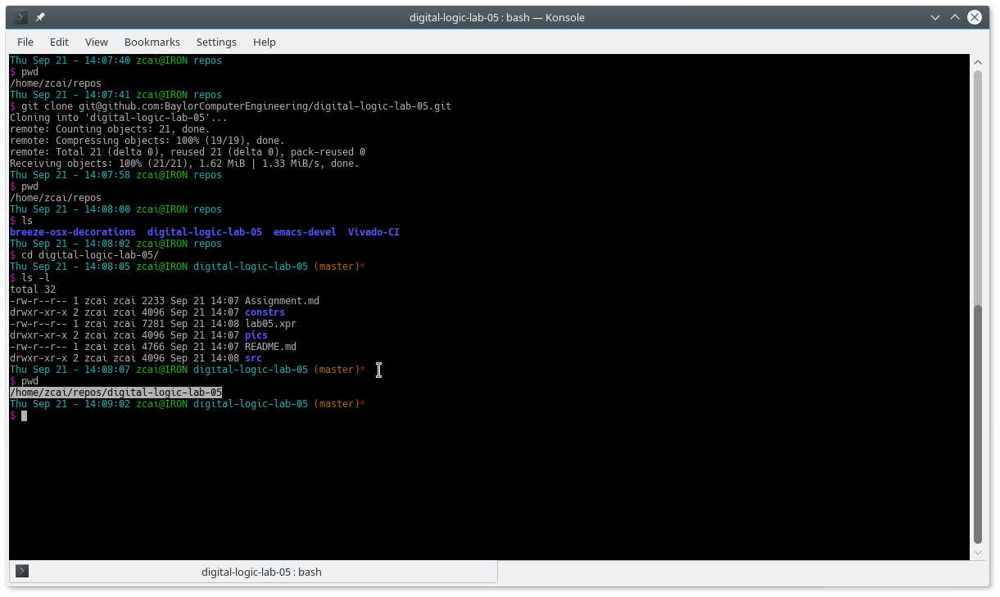

Note that the path of my assignment repo is ```/home/zcai/repos/digital-logic-lab-05```

2. Create project
  Choose your project path and project name **DO NOT** create project subdirectory.
  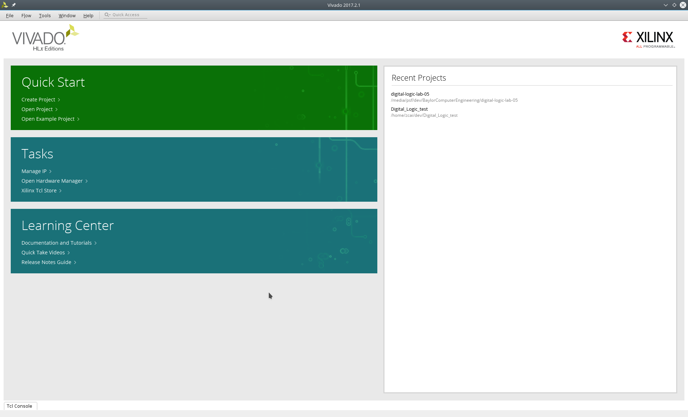
  
  when choosing path, make sure:
  
  - **Uncheck** "create project subdirectory" option, **It's a MUST**
  - Choose the path to be your assignment repository's folder
    
  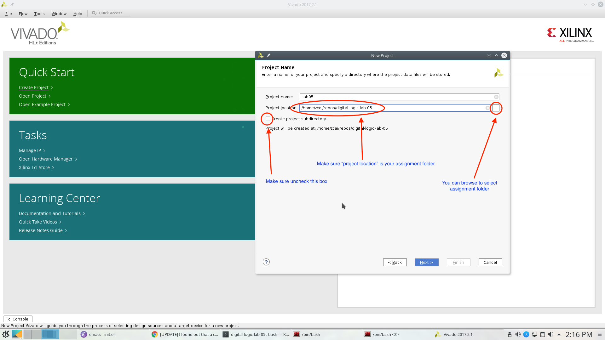

  Hardware part is not important this time, choose anything and go to next.
  
  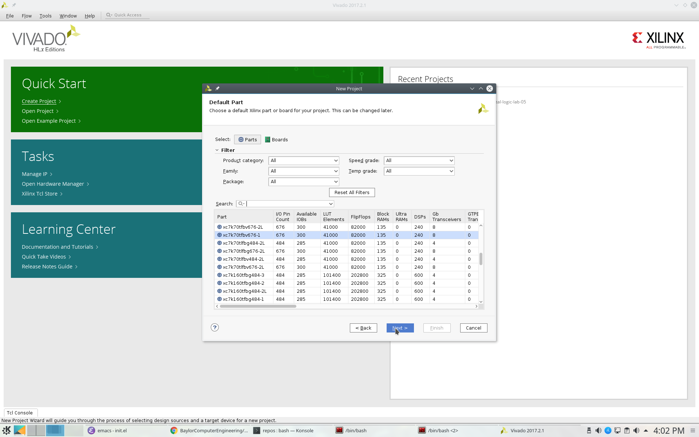

3. Add or create files
  <!-- - All sources files, i.e. files end with .v extention, must be stored in src directory in your assignment. (If src is not there, create a folder named "src"). -->
  Verilog files can be created inside or outside vivado. If you created the file outside vivado, you need to add it to the project when you want to use it.

  There are two different types of source files to Vivado:
  - Design source:
    Regular modules that can be implmeneted in hardware
  - Simulation source:
    Modules that strickly only used in simulation, usually these are just modules contain your test code.

  There is also a type of file called constraint file that specify your target hardware's configuration. They are not considered sources, and are usually provided by hardware vendors. Since we are only doing simulation here, we won't be need it this time.

  **For this lab, I require ALL source files, i.e. both design sources and simulation sources, to be placed in "src" folder of assignment folder.**
  Constraint file should be placed in "constrs" folder.
  
  We will only be dealing with simulation for this lab. So we will need to create a simulation set. **Note that, for assignment, I will specify the exact simulation set's name, you need to name your simulation sets to be the exact name I specified in the assignment**
  
  Right click anywhere on "Sources" window, and choose "Edit simulation Sets ...":
  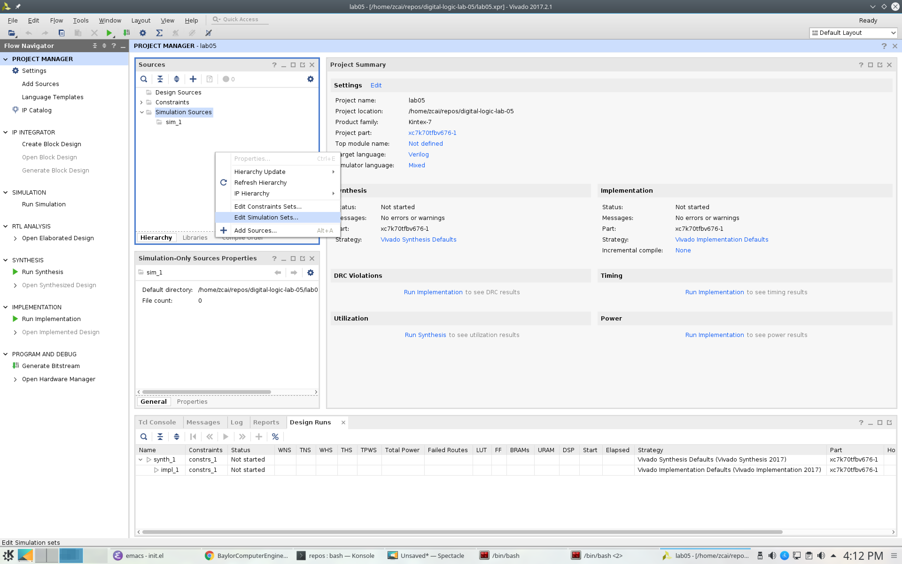
  
  Then click on the drop down menu and choose "Create Simulation Set ..."
  
  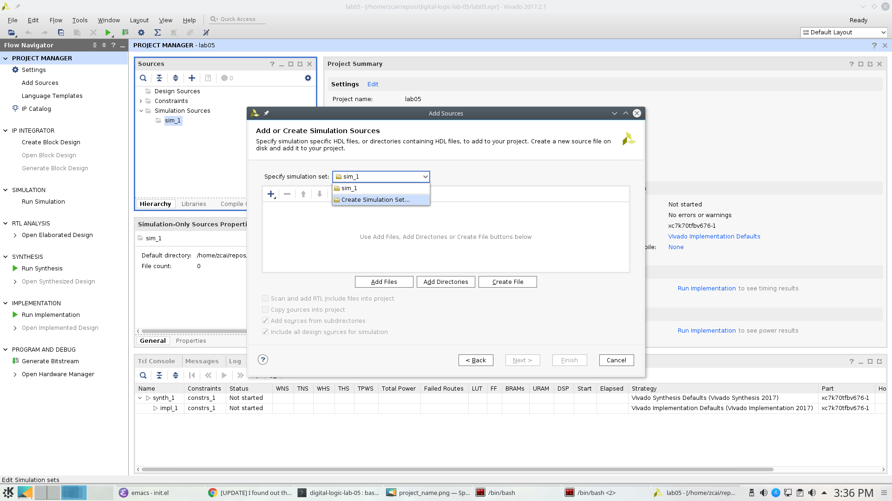
  
  We will name the simulation set as "halfadder_test". **Note: there cannot be space in any simulation set's name**.
  Since we are going to use this simulation, we will mark this simulation set as **active**. (You can also do this in Sources window by right clicking a non-active simulation set, and choose "make active" from the menu)
  
  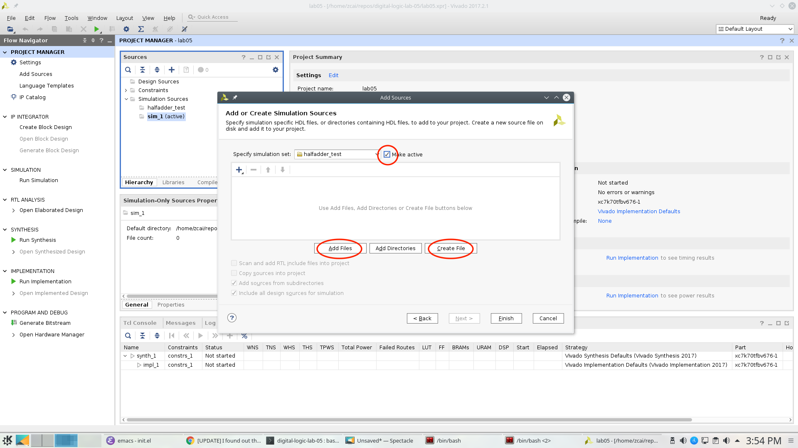
  
  To add a file click on the "Add Files" button in the same window, browse and select desired file. However, do make sure **UNCHECK the "copy sources into project" option**.
  
  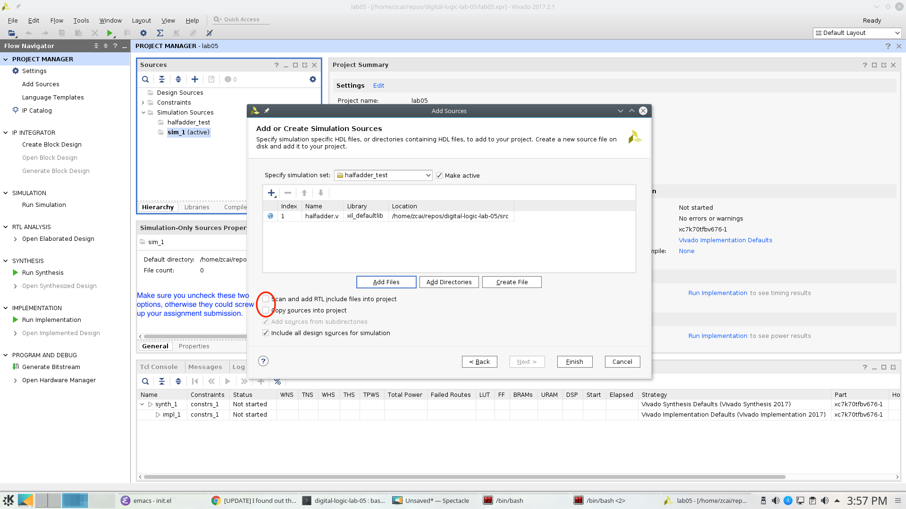
  
  In the same window, you can also create file. However, do make sure you **specify the file location**. Otherwise, Vivado will automatically store it in a location that will not be tracked by git.

  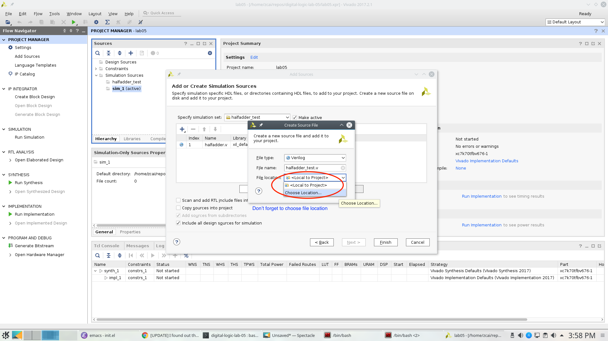
  
  The location must be the "src" directory inside your assignment folder
  
  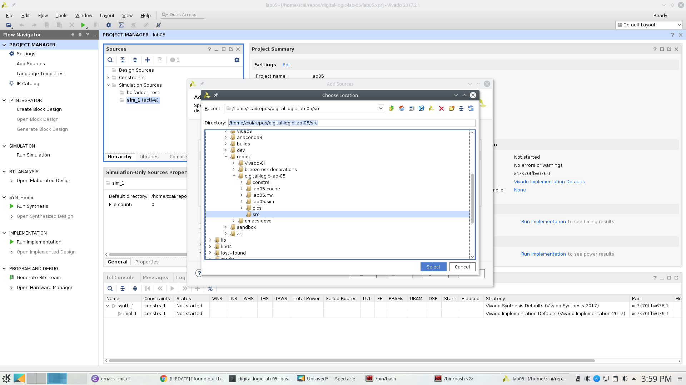
  
  This what it looks like after adding a file and creating a file, not that they both in "src" directory:
  
  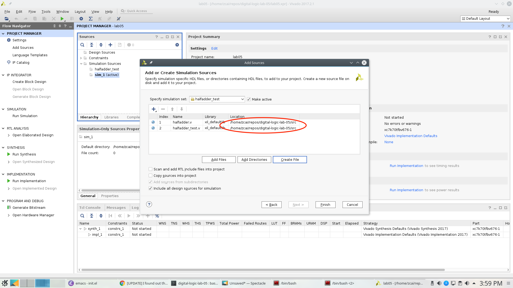
  
  Whenever you are creating a file with Vivado, the following window will pop up and asking you to specify inputs and outputs. Skip this window, we will type in inputs and outputs manually.
  
  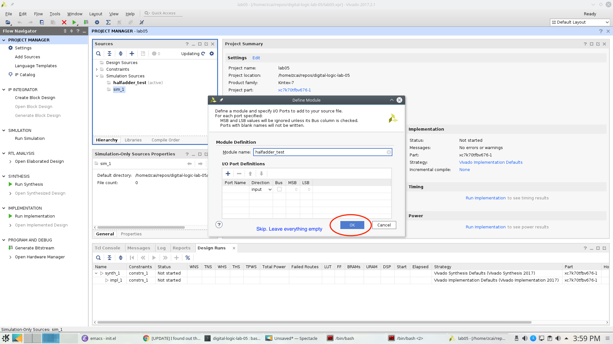
  
  At the end, you will see the files we added and created will show up in "Sources" window and under halfadder_test.
  
  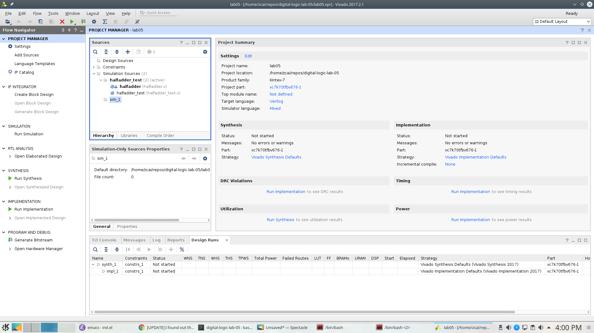

### Simulation

Click on run simulation, and here is the default layout:

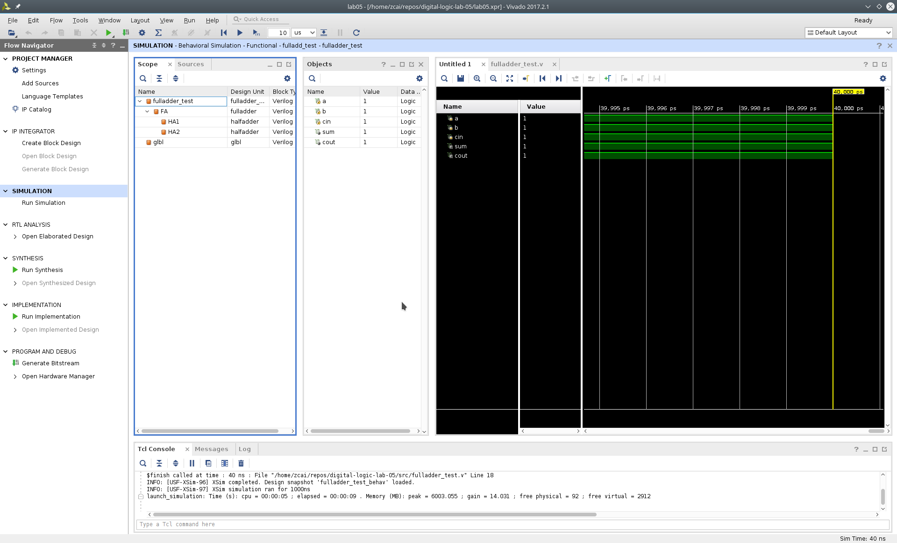

Click on "zoom fit" to have the best view of your timing diagram

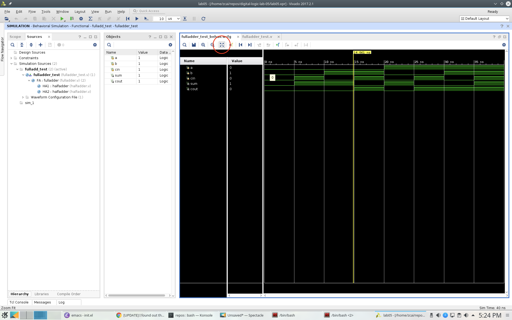
